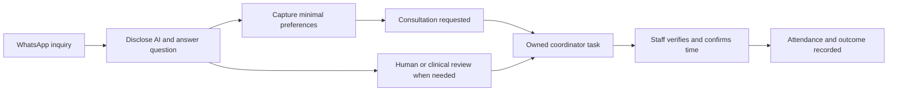

# OmniX: CTO plan for a sellable dental-clinic product

27 September 2026 • Planning and source review • One developer plus founder • English and Turkish initially

**Recommendation: keep the current stack, finish one complete patient-coordination workflow, and launch through a supervised clinic pilot.** Sell an AI International Patient Coordinator that answers from clinic-approved information and gets every consultation request to an accountable person. Personalized clinical judgment stays with the clinic.

The existing foundation is worth retaining. The product is not yet ready for unsupervised patient traffic. The remaining work is a combination of product completion, conversation design, operating evidence, and customer validation. A framework replacement would delay those outcomes.

This is a proposed execution baseline, not an assertion that its features have been implemented. This review changed documentation only. There is no pilot clinic yet, and no patient data, external messages, deployment, or paid model calls were used for this review.

Read alongside:

- [Detailed engineering and founder tasks](CTO_DELIVERY_BACKLOG_2026-09-27.md): owners, dependencies, effort, acceptance evidence, and release gates.
- [AI journey and evaluation specification](AI_PATIENT_JOURNEY_SPEC_2026-09-27.md): classification, routing, memory, example conversations, models, and quality tests.
- [PM strategy](../product/PRODUCT_STRATEGY_AND_MVP_PLAN_2026-09-26.md): commercial hypotheses and original PM01–PM09 scope.
- [Previous engineering plan](../archive/2026-09-qa-chain/5_IMPLEMENTATION_PLAN_S01-S18_2026-09-26.md) and [implementation evidence](../evidence/IMPLEMENTATION_RESULTS_2026-09-26.md): preserve these as history; reconcile their S01–S18 evidence rather than repeating completed fixes.

## 1. Decisions I would make as CTO

| Decision | Recommendation and reason |
| --- | --- |
| Initial buyer | Independent Istanbul dental clinic with recurring international WhatsApp inquiries and a named coordinator. Validate pain and buying authority before custom integrations. |
| Product promise | Accurate clinic information, consultation coordination, dependable human handoff, and visible follow-through. Do not promise diagnosis, treatment suitability, guaranteed conversion, or autonomous appointment booking. |
| First release | One location, one WhatsApp number, three staff accounts, English/Turkish, text-first intake, manually confirmed consultations, owned staff tasks, and a weekly report. |
| First scheduling integration | Clinic's existing calendar plus a persistent OmniX consultation record. Staff verifies availability and confirms. Build a connector only after a signed clinic needs it. |
| AI orchestration | Retain Python and LangGraph. Replace the rigid sales sequence with a small intent-and-policy graph. Retain NestJS as the authority for CRM writes and outbound delivery. |
| Model changes | Benchmark the current configuration against a cheaper classifier and a stronger writer. Use the result of English/Turkish evaluations to select production settings. No blind model upgrade. |
| Knowledge | Structured approved facts for prices, currencies, packages, hours, and scheduling policies; versioned retrieval for narrative FAQs. PDF upload alone is insufficient content governance. |
| Media | Disable autonomous dental-image interpretation for launch. Optional patient media goes through an approved consent/access workflow for staff review; defer audio unless a pilot makes it essential. |
| Onboarding/billing | Keep invitation-only onboarding. Founder manages setup and invoices. Add secure recovery/offboarding; self-service signup and payment automation can wait. |
| Expansion | No hair-transplant, voice agent, full CRM replacement, travel booking, or generic workflow builder before dental delivery and renewal are repeatable. |

LangGraph already supports the orchestration patterns this product needs. Its capabilities do not make the application's business state or delivery durable automatically; use the existing Nest/Postgres/outbox boundaries deliberately. [Official LangGraph overview](https://docs.langchain.com/oss/python/langgraph/overview).

## 2. What the PM got right, and what needs adjustment

**Keep:** dental first; a focused coordinator product; Today, Inbox, Patients, Clinic Knowledge, and Results; no compulsory photo before consultation; manual scheduling initially; stage-specific follow-up; honest outcome reporting; founder-led onboarding; pricing treated as a test.

**Change the execution order:** first establish the current release baseline and contracts, then implement consultation/task records with the AI journey. Prototype the screens against that workflow. Finish staging and operations before live traffic. Do not spend several weeks redesigning every existing screen before a complete conversation-to-confirmation demo works.

**Tighten the AI brief:** move away from “Senior Medical Sales Consultant,” mandatory rebuttals, routine before/after persuasion, and scoring skeptical patients lower. Answer the actual question, acknowledge uncertainty, remember preferences, and offer a useful next step. Trust and reduced coordinator workload are better product goals than making every message end in a sales question.

**Distinguish discovery from evidence:** competitor prices and the proposed 2,500 TL pilot / 7,900 TL founding / 9,900 TL standard prices remain PM hypotheses. This review did not re-audit competitor offers or validate willingness to pay. Do not publish allowances until metering and real costs exist.

**Start one clinic before three:** run one supervised design-partner pilot, fix operational problems, then onboard two more. One developer cannot safely absorb three simultaneous bespoke launches while building core features.

## 3. Current state: verified code versus previous reports

The workspace contains separate backend/frontend Git repositories with substantial existing local changes; the root is not a Git repository. Paths and task completion can move as other development continues. Freeze commit identifiers and a clean baseline in C01 before implementation. Do not delete or overwrite existing work.

| Area | Evidence inspected on 27 September | Consequence |
| --- | --- | --- |
| Reliability/security foundations | S01–S13 evidence reports local fixes for migration, invitation onboarding, inbound claims, outbound attempts, authorization, refresh, media handling, log redaction, graph output, and handoff. | Preserve these improvements. Reports of local success are not staging evidence. |
| Current type checks | Backend and frontend `tsc --noEmit --incremental false` passed using Node 22.17.1. | The earlier backend compile failure is no longer an observed blocker. |
| Python tests | `./.venv/bin/python -m pytest -q`: 38 passed, five dependency warnings. | Deterministic tests pass; this does not measure real model quality. |
| AI routing | [`edges.py`](../../apps/python-ai-service-v2/app/modules/agent/edges.py) sends a named patient without medical evidence to qualification before booking/pricing. A synthetic direct invocation confirmed it. | Replace the prerequisite and update tests that currently enshrine it. |
| Safety routing | [`policy.py`](../../apps/python-ai-service-v2/app/modules/safety/policy.py) classifies “Can you help me book a consultation?” as a human request. “Bir insanla konuşmak istiyorum” passes this input gate. A negated guarantee is rejected by the output gate. | Fix false positives and multilingual coverage. Passing the input gate does not prove the later model fails to hand off. |
| Patient memory | [`agent_servicer.py`](../../apps/python-ai-service-v2/app/grpc_services/agent_servicer.py) reconstructs medical evidence from lead status, initializes service interest to `None`, and reconstructs history from patient and AI message types. | Persist explicit facts, include staff messages, and support correction/resumption. A sales stage is not proof of a photo or consent. |
| Bound tools | [`nodes.py`](../../apps/python-ai-service-v2/app/modules/agent/nodes.py) binds retrieval, social proof, battlecards, and handoff. Other tools declared in `tools.py` are not automatically available to those writers. | Build and validate the actual profile/consultation/task actions end to end. |
| Consultation persistence | No consultation model appears in [`schema.prisma`](../../apps/backend-v2/prisma/schema.prisma). The PM's old `tools.controller.ts` source path is now absent; only backup/patch files remain. | Treat consultation creation and confirmation as missing workflow work, not an existing booking service to polish. Never restore a removed insecure controller merely to satisfy an old link. |
| Staff notes | [`LeadDetailDrawer.tsx`](../../apps/frontend-v2/src/components/leads/LeadDetailDrawer.tsx) has an unconnected COMMIT NOTE control and sample recovery/guarantee text. | Persist notes; remove sample patient assertions before demos or live use. |
| Knowledge retrieval | [`retriever.py`](../../apps/python-ai-service-v2/app/modules/rag/retriever.py) returns four nearest chunks scoped to organization, without relevance cutoff, approval/version filtering, or provenance in its return value. | Add answerability checks, source metadata, expiration, and structured prices. Nearest is not necessarily relevant. |
| Follow-up | [`follow-up.service.ts`](../../apps/backend-v2/src/follow-ups/follow-up.service.ts) schedules 12h/24h from AI replies. No approved-template send or window enforcement was found in the inspected delivery paths. | Replace fixed nudges with policy-controlled staff tasks first; gate all API sends, including human sends. |
| Analytics | [`analytics.service.ts`](../../apps/backend-v2/src/analytics/analytics.service.ts) counts READY_TO_BOOK and WON together. | Replace “AI conversion” with separate dated outcomes and denominators. |
| Public statements | [`page.tsx`](../../apps/frontend-v2/src/app/page.tsx) still contains SOC2 and hallucination-prevention assurances. [`ABOUT_PROJECT.md`](../product/ABOUT_PROJECT.md) overstates scheduling and autonomy. | Correct copy before any public launch. |
| Service boundary | Python [`main.py`](../../apps/python-ai-service-v2/main.py) binds an insecure gRPC listener; local Compose publishes port 50051. No authentication interceptor was found in that entry point. | Verify deployed exposure; require private access and authenticated callers. This observation is not proof of an internet-exposed production service. |

I did not rerun production builds, the complete database E2E suite, browser acceptance, provider sandbox tests, restore drills, or actual model requests. S14–S18 remain open in the inspected main implementation evidence. Database RLS is explicitly reported inactive. S06's removal of unsafe legacy methods does not establish authentication of every active Python endpoint; C04 revisits that specific boundary.

## 4. The experience we are building

A patient can ask three questions, switch language, decline a photo, correct their travel date, and request a consultation without restarting an intake script. The assistant identifies itself clearly at the beginning, answers with approved facts, asks only the next necessary question, and remembers what the patient has already said. It remains truthful about being AI when asked.

The coordinator opens Today and sees who needs attention, why, who owns it, and when it is due. In Inbox, the coordinator reads the original messages and an evidence-backed summary, takes over, confirms a real consultation, and records the outcome. The clinic owner can reconcile the weekly report to those records.

Consultation, clinical review, commercial outcome, and AI/human ownership are separate states. “Handed off” is not a lost sale; “qualified” is not a clinical determination; “requested” is not “confirmed.”

## 5. Architecture and delivery boundaries

Keep Next.js, NestJS, PostgreSQL/pgvector, Redis/BullMQ, Python, and LangGraph. Avoid adding a second orchestration framework or a separate database for conversation truth.

- **NestJS/Postgres:** source of truth for tenant access, profile facts, consent, consultations, tasks, approvals, action receipts, audit events, usage, and messages.
- **Python/LangGraph:** classify, retrieve, propose a bounded next action, and draft. It cannot grant consent, select an arbitrary tenant, confirm unavailable appointments, or write CRM state directly.
- **Outbox and delivery workers:** commit intent, check current permissions/version/window immediately before each send, reconcile provider outcomes, and surface ambiguous delivery.
- **Frontend:** explicit staff control, original transcript, evidence-linked facts, durable task ownership, and visible send/confirmation status.
- **Knowledge administration:** draft → approved → retired; approved versions bound to the clinic. Retired facts and cached retrievals become unavailable immediately.

Add narrow records rather than a workflow-builder framework: Consultation, CoordinatorTask, InternalNote, PatientFact/JourneyState, KnowledgeVersion/ApprovedFact, OutcomeEvent, and UsageEvent. Keep ClinicalReview and ApprovedQuote minimal in the pilot: audited records/references to clinician-approved information, with richer screens after validation. Details and transitions are in the backlog and AI specification.

## 6. Release gates and schedule

**G0 — reproducible baseline:** C01–C04. Current changes integrated, contracts clear, local tests reproducible, and service/auth boundaries verified. Founder starts discovery immediately.

**G1 — complete synthetic demonstration:** C05–C14, with policy-dependent features disabled until approved. Demonstrate inquiry → no-photo consultation request → owned task → staff confirmation → recorded outcome, plus uncertainty and takeover. All contacts are synthetic; this gate permits sales demos, not patient traffic.

**G2 — supervised live pilot:** all C01–C20 and founder F01–F04 accepted, including legal/data arrangements, language evaluation, real provider tests, recovery, and trained clinic staff. Launch in draft mode first, then enable only evaluated FAQ/intake paths. No waiver for tenant exposure, unapproved data processing, false clinical claims, or unavailable human escalation.

**G3 — repeatable paid service:** G2 remains green, P01–P03 completed or explicitly scoped out of the paid contract, F05 completed, and pilot findings resolved. Invoice continuation only under the agreed scope. A small pilot shows operational usefulness; it does not prove a causal conversion lift.

The detailed C01–C20 estimates total **44–69 developer days**. Add a 25% integration/rework allowance: approximately **55–87 days, or 11–18 development weeks** at five focused days per week. Provider approvals, finding the clinic, counsel, translations, and clinic sign-off are external dependencies and may extend calendar time. A 14-live-day pilot follows G2. P01–P03 add 5–9 days before widening the paid offer; some learning can occur during the pilot, but one developer cannot simultaneously deliver two full-time streams.

These are conservative planning ranges, not a promised launch date. Re-estimate after C01–C04. Pull the synthetic demonstration forward as a thin vertical slice; do not wait for the full polished dashboard to start discovery. Reduce calendar time by cutting optional scope and using founder-led knowledge/reports, while preserving the live-data gates.

Suggested cadence: one active engineering ticket, one review/verification slot, and one founder dependency queue. Every Friday review the actual complete journey, remaining risks, observed task effort, and next week's bottleneck. Do not track progress as a percentage of files written.

## 7. Privacy, safety, and operating readiness

Patient chat text itself can reveal health information even when images are disabled. Health data falls within special categories under the Turkish law; the applicable processing basis and service roles must be decided for this deployment. [KVKK law, including Articles 6 and 9](https://www.kvkk.gov.tr/Icerik/6649/Personal-Data-Protection-Law).

Founder and qualified counsel complete the clinic agreement, processing instructions, subprocessors/hosting locations, retention/deletion schedule, access rights, incident process, and applicable international transfer mechanism. Existing media consent is not a blanket authorization for cloud processing or transfers. The authority publishes transfer regulations and standard contract materials. [KVKK transfer materials](https://www.kvkk.gov.tr/Icerik/7998/Standart-Sozlesme-Metinlerinin-Ingilizce-Cevirisine-Iliskin-Duyuru).

OpenAI API data is not used for training by default unless opted in; retention depends on endpoints and settings. `store=false` does not by itself establish zero retention or legal compliance. Verify the actual account, region, endpoint, logging, and contractual controls before patient traffic. [OpenAI data controls](https://developers.openai.com/api/docs/guides/your-data).

For WhatsApp, enforce the 24-hour service window from the latest patient message and approved templates outside it, with permission and opt-out handling. Human API replies need the same delivery gate. Also verify that the specific clinic workflow fits Meta's current health-information restrictions. [WhatsApp Business Messaging Policy](https://business.whatsapp.com/policy).

Proposed internal operating targets, to measure before promising them: P90 useful text reply within 30 seconds, P99 within 60 seconds under the agreed pilot load; handoff acknowledged within 15 staffed minutes, with clinic-approved after-hours wording; restore target RPO ≤1 hour and RTO ≤4 hours. If a target fails, fix it or agree an honest narrower target before sale. Do not imply around-the-clock human staffing.

## 8. Commercial readiness and success criteria

Founder work starts now: ten workflow interviews, one willing design partner, a named coordinator and clinician approver, a clinic knowledge pack, known calendar/WhatsApp ownership, and an agreed pilot scope and continuation price. Use the PM offer as a starting hypothesis; do not divert development into subscription machinery.

Count distinct eligible new inquiries separately from existing-patient support, spam, duplicates, and tests. Track requested, confirmed, attended, quoted, won/lost, and unknown outcomes independently. Show sample size, cohort dates, follow-up period, and missing outcomes. A 14-day pilot can establish usability and consultation progress; continue observing later outcomes for 30–60 days under agreed data/contract terms.

Recommended pilot success conditions: all critical safety/access scenarios pass; every pending request/handoff has an active owner or visible escalation; the clinic can confirm and recover from failures; bilingual reviewers accept the conversation quality; usage and costs reconcile; staff use the workflow; and the buyer accepts continuation at the agreed price. Seek at least 30 eligible inquiries before interpreting the funnel; less is an inconclusive commercial sample, not an engineering failure.

Measure contribution as collected subscription revenue minus AI/embedding/retry costs, provider fees borne by OmniX, hosting, direct support, and recurring onboarding effort. Count founder time at an explicit economic rate. The PM's 70% recurring contribution target is a proposed business gate, not observed margin. Never equate requested consultations with revenue.

## 9. Immediate next actions

1. Developer: C01, then C02–C04; preserve current fixes and establish the executable baseline.
2. Founder: F01 and F02 now; finding the design partner and approving clinic content are on the critical path.
3. Developer: C05–C07 as the first product slice, then the AI classification/knowledge work; remove the photo prerequisite with the replacement behavior and evaluations together.
4. Founder + developer: review the synthetic patient journey weekly, using the AI specification as the acceptance rubric.
5. Activate patient traffic only after the dated G2 release checklist has named owners and evidence.

The first sellable advantage should be simple to demonstrate: a patient gets a useful, honest answer, and the clinic never has to guess who owns the next step.
