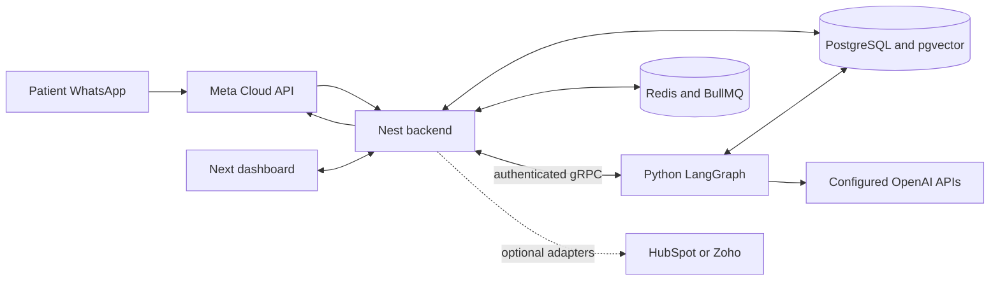

# OmniX: current product and engineering walkthrough

Inspected 4 October 2026. This is an orientation snapshot, not a new execution plan. The task queue remains `docs/plan/PRODUCT_EXECUTION_TASKS.md`.

Evidence labels: **code** means inspected in this checkout; **recorded** means earlier test/deployment evidence, not rerun today; **planned** means a task/spec exists without the complete feature. Secrets and real patient data were not inspected.

## 1. What we are building

OmniX is an invitation-only AI patient-enquiry and sales workspace for dental clinics, initially Istanbul clinics serving international patients. Older names OmniDesk AI, OmniDesk_ai and AI Sales Agent refer to the same project. Hair-transplant examples and broad industry fields survive in older code/docs; the current product direction is dental.

The product joins three things: a WhatsApp patient coordinator, an internal CRM that owns patient-enquiry records, and a staff dashboard with human takeover. A patient messages the clinic; the assistant answers and collects information; staff handle clinical uncertainty, consultation confirmation, and commercial decisions.

This is not yet a complete clinic operations product. Phase 1 concentrates on reliability, security, and safe message handling. Consultation records, owned coordinator tasks, quotes, and the richer clinic workflows come next. Real patient traffic is not approved in the current project records.

## 2. Which version is “current”?

The workspace root has no Git repository. Each app is a separate repository. Root docs and memory are unversioned, backed up by the founder. This makes cross-service releases and documentation consistency a manual responsibility.

| Service | Checked-out branch | Inspected HEAD | Recorded staging revision |
| --- | --- | --- | --- |
| Nest backend | `qa-1f/fixes` | `74202ca` | `357f849` |
| Next frontend | `qa-1f/fixes` | `c2115c4` | `75dccbd` |
| Python AI | `qa-1f/fixes` | `4ff4ec5` | `81ac3de` |

All three working trees were clean before this inspection. Latest fixes are recorded as pushed but unmerged. They include the earlier `cln-1/cleanup` branch; project instructions call for CLN-1 merge first, then QA-1F. Staging revisions come from `memory/current-state.md`, not a live Railway inspection today. Production state was not checked or changed.

Some app-local CLAUDE files and older context pages still describe issues already fixed. Read actual code, recent evidence, and current-state before older prose. The Stage 2 package title says “accepted D-020,” but the task queue explicitly says D-020 is missing and founder scope confirmation remains open.

## 3. Local access prepared during this inspection

Dashboard: `http://localhost:3001/login`. API: `http://localhost:3000`.

An ACTIVE local Super Admin, one synthetic dental clinic, six synthetic patients, six pipeline stages, and twelve illustrative transcript messages were created in a new isolated database. Login through the real browser reached the dashboard showing six leads, one handoff, and 33% pipeline progress.

This is a UI/API exploration demo. PostgreSQL and Redis run in dedicated containers `omnix-local-demo-pg` and `omnix-local-demo-redis`, on loopback ports 15434 and 16380. No real WhatsApp channel or paid AI provider was connected; Python AI is not running in this demo. PDF processing and AI generation need that service. Sample conversations are paused. Historical synthetic staff messages are display examples, not proof of provider delivery.

Demo configuration, seed script, startup script, process IDs and logs are in `/private/tmp/omnix-local-demo-20261004/`. Credentials were given privately in the chat and are intentionally omitted here. Temporary files may disappear after system cleanup. Backend and frontend processes have been left running for exploration.

To restart after stopping services, start the two named containers, then run `bash /private/tmp/omnix-local-demo-20261004/start.sh` **only when ports 3000/3001 are free**. Do not rerun `seed.cjs`: it is a one-time seed, not idempotent. Stop the exact PIDs in `backend.pid` and `frontend.pid` after confirming they still identify these processes; `docker stop omnix-local-demo-pg omnix-local-demo-redis` preserves demo data. No existing container/database was modified.

The repository's old `prisma/seed.ts` advertises `admin@clinic.com` and a sample password. It omits `User.status`, whose schema default is PENDING. Current login requires ACTIVE, so a fresh seed does not create a usable login. It is also non-idempotent and lacks the complete demo setup. The new demo avoids relying on it.

## 4. Every current screen

| Route | What exists | Practical limits |
| --- | --- | --- |
| `/` | Public landing page | Marketing copy is not evidence of a working capability; claims review remains open. |
| `/login` | Email/password login | No clinic picker; multi-clinic identities can be stranded. |
| `/signup` | Invitation information | Public API signup returns 403. |
| `/accept-invitation` | Token-based invitation acceptance | Link is supplied privately, not automatically emailed. |
| `/recover` | Operator-assisted password recovery | Not a complete public forgot-password email product. |
| `/onboarding/create-organization` | Create first clinic workspace | Existing ACTIVE membership returns existing workspace; no second-clinic creation through this flow. |
| `/dashboard` | Overview metrics and recent activity | Metrics are lead-status counts, not confirmed appointments, revenue, or measured AI conversion. |
| `/dashboard/conversations` | Rebuilt staff Inbox | Text composer; pause before reply; no staff attachment sender. |
| `/dashboard/leads` | Patient-enquiry table, profile drawer, create/edit forms | Current route renders a table, not a patient pipeline Kanban board. Notes/attachments tabs are unavailable. |
| `/dashboard/settings/ai` | Persona configuration | Saved persona reaching prompts remains one of the older end-to-end items needing reconfirmation. |
| `/dashboard/settings/lead-sources` | Source create/edit/delete and active state | Not automatic ad attribution. |
| `/dashboard/settings/pipeline-stages` | Stage CRUD and drag reorder | Stage mapping is separate from a confirmed consultation. |
| `/dashboard/settings/experiences` | Clinic case stories and image links | Consent field exists; live AI use/provider delivery has not been established in this inspection. |
| `/dashboard/settings/channels` | Channel list, manual connection, disconnection | Embedded Signup/coexistence not implemented. |
| `/dashboard/settings/integrations` | HubSpot-token form | Broken contract: posts `provider: HUBSPOT` to `/channels`, whose DTO accepts only WhatsApp/Instagram channel enums. |
| `/dashboard/settings/documents` | PDF upload, processing status, delete | PDF only, 10 MiB cap; local filesystem storage; Python required. |

No dedicated team-administration, calendar, billing, doctor-review, quote, or results-report screen appears in the current route tree. Staff invitations exist as backend endpoints; that does not imply a complete staff-management UI.

### Overview metric definitions

`totalLeads` counts clinic leads. “Active AI Chats” counts leads in NEW or QUALIFYING; it does not count actual unpaused conversations. “Needs Attention” counts HANDED_OFF leads. “Pipeline progress” is `round((READY_TO_BOOK + WON) / totalLeads * 100)`. Recent activity is the five most recently updated leads.

The dashboard currently marks every non-HANDED_OFF recent lead “AI Active,” even when its conversation is paused or its status is WON/LOST. The backend recent-activity projection sends `pipelineStageName` and no phone, while the frontend expects nested `pipelineStage` and `phoneNumber`; those details do not render correctly. These are orientation findings, not fixes performed today.

### Inbox details

Conversation list, filters, paginated history, sender labels, delivery indicators, connection state, patient panel, summary/contact editing, pause/resume, notification linking, and TR/EN text exist. Read failures have retry UI rather than appearing as an empty Inbox. The composer is disabled while AI is active, state actions are pending, session data is refreshing, or send state needs reconciliation.

Messages distinguish patient, AI, staff, draft and system content. Delivery labels include pending, sent, delivered, read, failed, cancelled and uncertain. Provider acceptance is not delivery. An uncertain outcome must be reviewed; the UI does not encourage blind retry.

Patient edits send only changed fields; masked phone/email values are protected against accidental overwrite. Realtime updates merge by ID and update timestamp so a repeated creation event cannot erase a receipt or an uncertain send result.

### Patient-enquiry CRM details

Create/edit includes names, phone/email, residence, currency/value, source, lifecycle status, priority, expected arrival/service date, language and social links. The lead table has search across name/phone/email/country, structured advanced filters, sort, URL-persisted query state, pagination, edit/delete/profile actions, and a link to the associated conversation.

Lead status: NEW, QUALIFYING, QUALIFIED, READY_TO_BOOK, READY_TO_PAY, HANDED_OFF, UNQUALIFIED, WON, LOST. Priority: HOT, WARM, COLD. Currency: USD, TRY, EUR, GBP. A custom pipeline stage can map to a lead status. READY_TO_BOOK is an interest/readiness signal, not a confirmed appointment. READY_TO_PAY is not a payment transaction.

## 5. User flows, end to end

### A. First clinic owner

Operator issues a purpose-bound invitation via the backend CLI. The command creates a private output file; it does not send email. Owner opens `/accept-invitation`, supplies name/password, consumes the one-time invitation, then logs in. Initial activation returns no session. Without a clinic, the owner goes to workspace onboarding. Provisioning atomically creates the organization, persona, standard roles/permissions and owner membership. Repeated/concurrent provisioning returns one workspace.

The owner configures persona, knowledge PDFs, source/stage definitions and a WhatsApp channel. Invitations expire after one hour; password acceptance requires at least 12 characters and at most 72 UTF-8 bytes. Revoked, expired and consumed tokens fail. PENDING/SUSPENDED/deleted users cannot log in.

### B. Invite an existing clinic's staff

An authorized owner calls the clinic invitation API with the invited identity and allowed role. Acceptance creates/activates the clinic membership. Existing ACTIVE users must accept as the correct authenticated identity; invitations cannot silently overwrite their password. Manager/Agent cannot issue owner invitations; role IDs from another clinic are rejected. This is backend-supported, without a complete team UI.

Default roles: Super Admin has all catalog permissions. Manager has all except `organization:manage`. Agent can manage assigned leads/conversations, see PII/message history by default, read documents/channels/experiences/pipeline, and use notifications. Agent has no `leads:read:all`, analytics, configuration management, export, or owner administration by default. Membership-specific grant/deny overrides can narrow access further.

### C. Patient sends WhatsApp text

1. Meta calls the WhatsApp webhook. Nest verifies the signature against exact raw bytes.
2. Backend resolves a unique channel/clinic; missing or ambiguous routing is rejected/dropped safely.
3. Worker finds/creates clinic-scoped lead and conversation and stores inbound messages with duplicate protection.
4. Each new inbound advances `stateVersion`, invalidating obsolete in-flight AI work.
5. Transactional outbox and BullMQ schedule a debounced conversation turn; the outbox uses a seven-second debounce.
6. A worker claims generation with an owner/expiry lease and calls authenticated Python gRPC.
7. Python reads conversation context, runs extraction/routing, retrieves clinic knowledge and produces reply bubbles plus proposed actions.
8. Nest validates actions, permissions and conversation state; it owns durable mutations and provider delivery.
9. AI disclosure is ordered before the first answer. Each bubble has a durable outbound intent and is rechecked before sending.
10. Provider receipts advance sent/delivered/read state. Socket events refresh authorized staff views.

QA's recorded synthetic timing was roughly 10–16 seconds for initial replies and around 2.7 minutes after a forced crash. These are local harness observations, not production performance promises.

### D. Staff takeover and return to AI

Staff opens the Inbox, reads transcript/summary, pauses AI, then sends a text reply. Pause updates state and invalidates stale AI work. Model/deterministic escalation can hand off, pause AI, set handoff state and notify staff. Current branch uses fixed localized handoff text for model escalation. Missing persona pauses the conversation and alerts staff rather than silently dropping it.

Resuming does not automatically answer messages that arrived while paused; the next new message triggers AI. This is a proposed default awaiting founder confirmation. Manual staff sends after patient STOP are allowed with an opt-out warning/audit under the recorded product decision; AI and automated follow-ups are blocked. Free-form staff sends still respect the 24-hour messaging window and channel availability.

### E. STOP/START and media consent

STOP is a whole-message deterministic command, not an LLM guess. It records tenant-scoped opt-out, pauses AI and cancels automated follow-ups. A regular later message does not clear opt-out; explicit START does. `cancel`/`iptal` do not count as STOP. Turkish words are partly implemented but await native review. Long sentences such as “please stop messaging me” do not match the exact-command parser automatically and remain visible to AI/staff.

Media consent is a separate state. `I CONSENT` grants and `WITHDRAW CONSENT` withdraws it; Turkish copy still instructs English commands. Media download has bounds and retention (default 30 days). Current storage uses base64 on message records; object storage is planned. Patient image analysis is disabled by default. Do not equate media consent with consent to automated diagnosis or unlimited third-party processing.

### F. Follow-up

After an AI reply, the backend schedules 12-hour and 24-hour no-reply records. A new patient message cancels pending follow-ups. The first may send only if eligible and within the allowed window. The second is a staff alert for an unresponsive lead, not a free-form patient message outside the window. Leases/recovery requeue overdue work. A configured template registry is not present yet.

### G. Clinic knowledge and case stories

Staff uploads a PDF. Backend checks PDF magic bytes and upload size, stores metadata/file, and sends bytes to Python. PyMuPDF extracts text; it is split into 1,000-character chunks with 150-character overlap; OpenAI embeddings use 3,072 dimensions. Chunks are stored in clinic-scoped pgvector records. Re-ingest embeds first, then atomically replaces document chunks under a transaction/advisory lock, preserving old knowledge on embedding failure. Processing status is PENDING/PROCESSED/ERROR.

Question retrieval embeds the query and selects the clinic's nearest four chunks by cosine distance. No complete approval/provenance/relevance-threshold system exists. Therefore “answers from approved facts” is a product requirement that the current retrieval implementation only partially realizes. Document deletion still asks Python to delete by filename, which can collide within a clinic. Full OCR/page-level citations and batching are not established.

Experiences hold title, country, procedure, story, before/after URLs and consent; embedding RPC exists. Battlecards hold competitor/objection/rebuttal and embeddings, with seeding/tools but no dedicated editor route. Neither subsystem establishes clinical efficacy or patient-image permission by itself.

### H. Consultation and payment today

The AI can recognize interest and propose a readiness/handoff change. Staff must confirm appointments externally/manually. There is no dedicated consultation request/confirmed-slot/attendance domain model, calendar reservation, checkout, deposit collection or payment confirmation. The planned flow is request → owned task → staff confirmation → reschedule/cancel → attendance, followed later by doctor review and approved quote.

### I. Account recovery and session transitions

Operator supplies a recovery capability link; the user consumes it on `/recover`. Recovery changes security version and revokes sessions; old JWT/socket identity is rejected. Logout clears session state. Refresh tokens rotate and have reuse detection. Latest branch allows a ten-second grace for a recently rotated token in a still-live family to avoid parallel-tab logout; replay after grace kills the family. That default still awaits founder approval.

Frontend centralizes session installation/reset, clears old tenant caches on identity changes, fences in-flight requests, and reconnects the shared socket. Web Locks serialize refresh across tabs when available; single-flight avoids duplicate refresh in one tab. Latest fix handles server-driven socket expiry and refreshes the Inbox without a click.

## 6. Technical architecture

Frontend: Next.js 16.2.4, React 19.2.4, TypeScript, Tailwind 4, Radix/shadcn, Lucide, Sonner, TanStack Query 5, Zustand 5, Axios, React Hook Form/Zod and dnd-kit. Fonts are bundled Inter/Montserrat with Latin-ext. UI is partly Turkish/English, not fully localized.

Backend: NestJS 11, Node 22+, TypeScript, Prisma 7.8, PostgreSQL, Redis/BullMQ, Socket.IO, scheduled workers, Pino and Prometheus. It owns auth, memberships/permissions, tenant enforcement, CRM records, ingress, action execution, delivery, follow-ups, notifications and audit.

Python: Python 3.13 target, FastAPI, grpc.aio, Pydantic Settings, SQLAlchemy/psycopg2, LangGraph/LangChain, OpenAI SDK, PyMuPDF and pgvector. Active services come from `main.py` importing `app/grpc_services/`. FastAPI supplies health; business RPCs are SalesAgent and DocumentProcessor.

AI graph nodes: extract/classify, qualification, objection handler, value pitch, closing, general QA, out-of-domain, compliance checker, summarizer. Main writer routes pass through the LLM compliance node; out-of-domain differs, while deterministic output safety is applied by the servicer. Extraction/classification and sales routing still need representative EN/TR paid-model evaluation.

Model settings have defaults `gpt-5.6-luna` (flagship/cheap), `gpt-5.6-terra` (extractor), `gpt-4o-mini-transcribe` (audio), `text-embedding-3-large` (embedding). Configuration validation checks shape/requirements; it does not prove an account can call those model IDs. Default availability remains unverified. Voice transcription code exists; voice/image/PDF live runtime was not established by the latest fake-provider QA. Default image analysis is off.

## 7. Data ownership and safety mechanisms

| Group | Models |
| --- | --- |
| Clinic and identity | Organization, User, OrganizationMembership, Session |
| Authorization | Permission, Role, RolePermission, MembershipPermissionOverride |
| Activation | AccountInvitation, AccountActivationEvent |
| CRM | Lead, LeadSource, PipelineStage, CrmSyncLog |
| Conversations | Conversation, Message, OutboundAttempt |
| Knowledge | OrganizationDocumentation, OrganizationKnowledge |
| Sales evidence | OrganizationExperience, OrganizationBattlecard |
| Assistant/channel | AiPersona, Channel, Credential, ScheduledFollowUp |
| Operations | Notification, AuditLog, OutboxEvent |

Lead phone is unique within a clinic. Conversation external contact is clinic-scoped; lead/conversation relation is optional one-to-one. The lead has names/contact, country/timezone/languages, source/stage/assignment, summary, status/priority, estimated value/currency, service/follow-up timing, opt-out, consent metadata and external CRM IDs.

Conversation stores pause/handler/disclosure, assignment/channel, `stateVersion`, generation owner and lease. Message stores sender/type, text/media/expiry, status/metadata, provider ID, outbound key and processing lease. OutboundAttempt distinguishes PENDING, SENDING, ACCEPTED, UNKNOWN, FAILED and CANCELLED. Message delivery distinguishes SENT, DELIVERED and READ separately.

**UNKNOWN is intentional:** provider may have accepted a request whose response was lost. Retrying can duplicate patient messages, so SENDING/UNKNOWN are not blindly resent. Claims, leases, idempotency and state checks address duplicate/restarted workers and takeover races; they do not make provider delivery globally exactly-once.

Tenant identity comes from verified membership. Prisma's tenant extension and raw-SQL guard, HTTP permissions, per-emit Socket.IO revalidation, PII redaction and assigned-only checks protect access. PostgreSQL row-level security is not active; tenancy is primarily application-enforced. Separate backend/Python database roles reduce privileges, but Python still requires explicit tenant filters.

Integration secrets use encrypted Credential records (AES-GCM), with rotation/revocation. Legacy plaintext-looking schema columns remain but are not the supported runtime path. gRPC carries an internal shared bearer secret and deadlines; transport requires TLS or explicitly configured private-network mode. Staging private-network mode was recorded, production remains a close-out task.

Cookie-authenticated writes use Origin/Referer CSRF checks; auth/invitation routes use Redis-backed throttling. Refresh cookies are httpOnly. CSP is report-only and cannot yet be enforced as written. Headers include nosniff, frame denial, referrer and permissions policy. Local initials replace the former third-party avatar request.

Safety intent: disclose AI identity, no diagnosis/guaranteed outcomes/invented clinic facts, no individualized medical conclusions, no false confirmed booking, and escalation when needed. Deterministic guards and fixed handoff are implemented; multilingual clinical detection, retrieval relevance, prompt injection and LLM wording still have open quality gaps.

## 8. API and contract inventory

| API family | Current surface |
| --- | --- |
| Auth | login/logout/refresh/me; disabled signup; retired verify-email; accept invitation; clinic invite/accept; recovery consume |
| Organizations | first-workspace POST |
| Leads | list/detail/create/update/delete; PATCH stage |
| Conversations | list/detail/messages; POST staff message; POST ai-pause/ai-resume |
| AI persona | GET/POST `/settings/ai-persona` |
| Documents | list, upload, delete |
| Experiences | list/detail/create/update/delete |
| Sources/stages | CRUD; stage reorder |
| Channels | create/list/delete |
| Analytics | GET `/analytics/summary` |
| Notifications | list/unread count/mark one read/mark all read |
| Webhooks | GET WhatsApp verification, POST signed WhatsApp ingress |
| Operations | `/health`, `/ready`, metrics controller |

The old PATCH toggle-ai endpoint was removed; explicit pause/resume avoids non-atomic toggles. Body-less auth refresh currently returns 401 due to reading an undefined DTO; frontend sends `{}` and avoids that bug.

Cross-service contracts: protobuf, versioned AI action JSON plus validators, generated socket event contract, and Nest OpenAPI → Orval generated frontend client. Change both services and regenerate rather than hand-editing outputs. SalesAgent exposes GenerateReply and authenticated Ping; DocumentProcessor exposes IngestPdf, DeleteFile and EmbedExperience. Streaming generation is only a commented future RPC.

Allowed AI action names: CREATE_LEAD, UPDATE_LEAD, UPDATE_SUMMARY, HANDOFF_TO_HUMAN, PAUSE_CONVERSATION, NOTIFY_AGENT, SCHEDULE_FOLLOW_UP. AI lead changes are narrowed: phone/email and WON are not allowed in that action contract; proposed statuses are QUALIFYING, QUALIFIED, READY_TO_BOOK, HANDED_OFF. Backend remains the mutation authority.

CRM adapter code supports HubSpot/Zoho contact → deal synchronization and sync records, but the current integration screen is invalid and live accepted sync has not been proven. Instagram provider/service code exists; no complete signed Instagram inbound/staff/AI flow was verified. Permission names such as `leads:export` do not imply an export implementation.

## 9. Reliability, deployment and verification

Workers cover WhatsApp inbound, AI replies, follow-ups and outbox relay. In-process crons cover outbox polling, stale lease recovery, uncertain send transitions/retries, follow-ups, media expiry and socket revalidation. The supported deployment assumption remains one replica: no Socket.IO Redis adapter, in-process crons, local file uploads.

`/health` and `/ready` exist. Latest backend `/ready` authenticates to Python's new Ping; deploy Python before backend or old Python returns UNIMPLEMENTED. Prometheus/Pino exist, but real production alerting/SLA is not established. Production metrics require configuration/token protections and Swagger is restricted.

Database deploy must go through `npm run db:deploy`: migrations plus encrypted credential upgrades and runtime-role password handling. Avoid raw migration shortcuts. Existing Compose is incomplete (Redis variable mismatch, missing newly required auth/RPC/Meta settings). Nest defaults to 3001, colliding with Next unless PORT is explicit. Python's old uvicorn executable path can be stale; use `python -m uvicorn` with the intended interpreter.

Recorded QA-1F checks: backend 231 unit tests; frontend 108 tests, lint and build; Python 125 tests; contract checks; disposable database suites for inbound claims, tenant isolation, invitations, refresh races, abuse, provisioning, health, media consent, pilot and permission/socket matrices. A real two-tab Chromium run verified socket expiry/reconnect and new inbound visibility. These are dated evidence, not suites rerun during this orientation. Today newly verified: isolated migrations, ACTIVE demo provisioning, and browser login/dashboard.

Recorded fixes on latest branch: deterministic first-bubble disclosure ordering, preservation of inbound messages despite credential outages, authenticated readiness, missing-persona handoff, refresh-tab grace, server-disconnect socket recovery, fixed model-handoff text, local avatars/branding, and removal of deprecated toggle.

Not established by those tests: paid-model wording/clinical quality, full multilingual injection defense, live voice/image/document provider flow, full hosted browser acceptance, two-instance operation, or supervised real-patient pilot acceptance. Historical staging has one recorded synthetic WhatsApp → AI → WhatsApp round trip; that is not a production-readiness certificate.

## 10. What is still missing and how to regain direction

Current close-out: review CLN-1/QA-1F, accept Phase 1, confirm proposed defaults and Stage 2 scope, deploy in the correct order, configure health checks/rollback and scheduled backups, finish production password/transport checks, triage dependency advisories and CSP, and resolve native Turkish/privacy decisions. CI peer-repo token is recorded to expire 6 October 2026.

Planned Phase 2 cards:

1. P2-01 domain records and clinic-picker groundwork.
2. P2-02 owned handoff tasks and persistent private notes.
3. P2-03 consultation request/confirmation/reschedule/cancel/attendance.
4. P2-04 Meta onboarding/Embedded Signup/coexistence.
5. P2-05 phone-app message echoes that trigger takeover.
6. P2-06 click-to-WhatsApp referral/source reporting.
7. P2-07 staff files/media and private object storage.
8. P2-08 PWA push handoff alerts and fallback.
9. P2-09 saved replies and reviewed staff translation.
10. P2-10 doctor review and approved quote PDF/link.
11. P2-11 Instagram DM.
12. P2-12 lead import/export and cross-channel linking.
13. P2-13 lead-form intake and approved first-contact templates.
14. P2-14 “try the assistant” sandbox.
15. P2-15 acceptance and Phase 3 expansion.

These are planned, with scope acceptance still needing reconciliation. Phase 3 improves approved knowledge/retrieval, memory, graph behavior and evaluations; Phase 4 adds daily operations; Phase 5 is the supervised pilot. External calendar automation, payment/deposit collection, native apps, broadcasts, travel logistics and autonomous photo interpretation are outside current implemented scope.

The next coherent product milestone is one synthetic enquiry becoming a staff-owned, confirmed consultation with a recorded outcome. It connects the existing Inbox/CRM foundation to a visible clinic benefit. Use the existing task queue to reach it; avoid treating all integrations and AI enhancements as simultaneous prerequisites.

## 11. Files to navigate as an engineer

Start with root `CLAUDE.md`, `memory/current-state.md`, `memory/known-issues.md` and `docs/plan/PRODUCT_EXECUTION_TASKS.md`. Product evidence is under `docs/evidence/`; superseded work is under `docs/archive/`.

Frontend entry points: `src/app/`, `src/features/inbox/`, `src/components/leads/`, `src/lib/session-manager.ts`, `src/lib/token-refresh.ts`, `src/lib/socket-runtime.ts`, `src/hooks/useSocket.ts`, generated API files and auth store.

Backend entry points: `prisma/schema.prisma`, `src/main.ts`, `src/app.module.ts`, `src/auth/`, `src/core/tenant/`, `src/prisma/prisma.service.ts`, `src/webhooks/`, `src/conversations/`, `src/follow-ups/`, `src/core/outbox/`, `src/events/`, `src/credentials/`, `src/config/env.validation.ts`.

Python entry points: `main.py`, `app/core/config.py`, `app/grpc_services/`, `app/modules/agent/`, `app/modules/rag/`, `app/modules/safety/`, `app/infrastructure/llm_factory.py` and database service. Prisma schema and runtime imports outrank stale ERD/comments.

For verification use the backend's cross-service quality gate and disposable-DB runners, frontend Vitest/Playwright, Python pytest and generated-contract checks. No rewrite is justified solely by the project's size: existing review verdicts say keep and improve.
